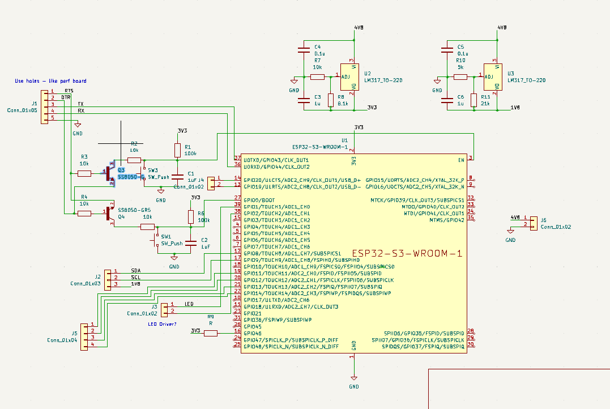
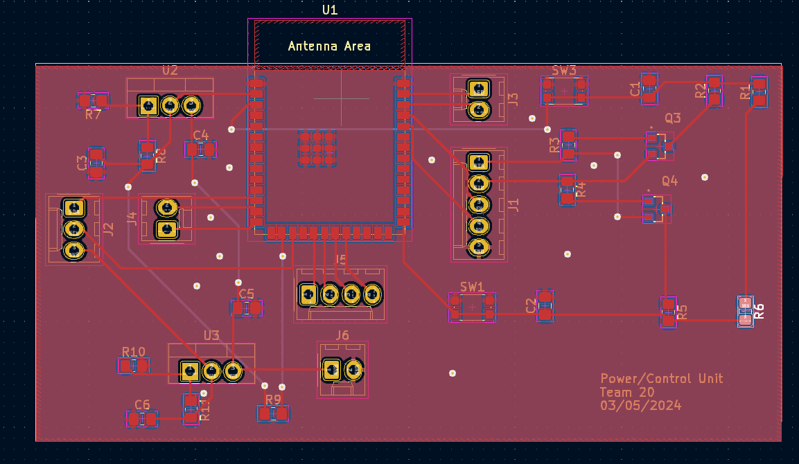

# 02/21/2024
### Pins we will need to use on the ESP32-S3-WROOM-1
* Power -> 3V3
* Ground -> GND
* Enable -> EN
* Strappint Pins -> GPIO0, GPIO3, GPIO45, GPIO 46
* USB -> GPIO 19, 20
* JTAG -> GPIO39, GPIO40, GPRIO41, GPIO42
* UART -> GPIO43, GPIO44
* SPI -> GPIO10, GPIO11, GPIO12, GPIO13
* LEDs -> GPIO1, GPIO2

# 03/19/2024
### Control Unit Schematic and PCB for the first PCB order

