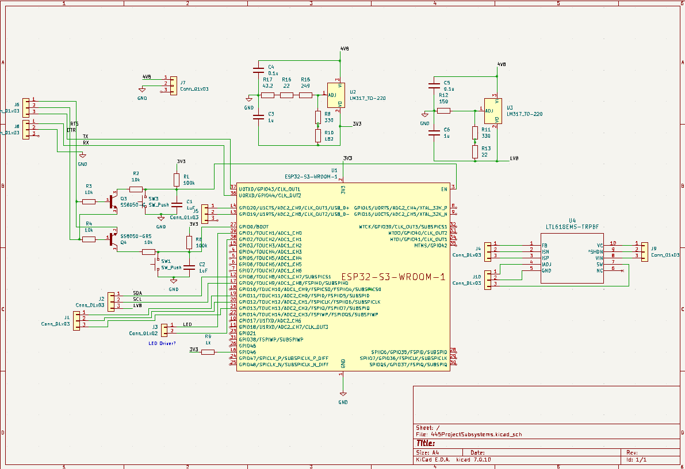
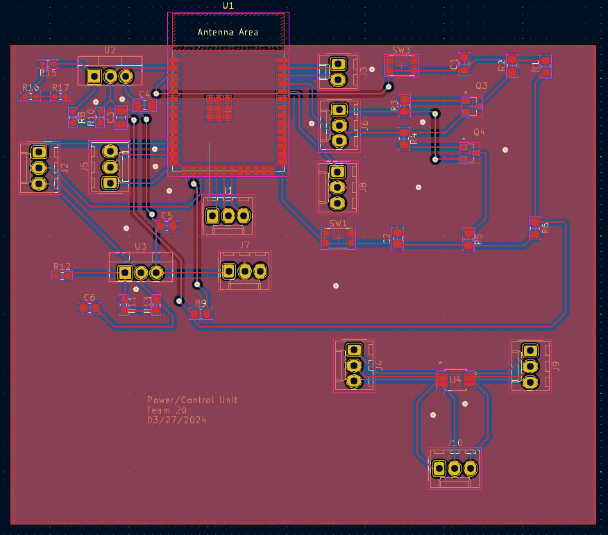
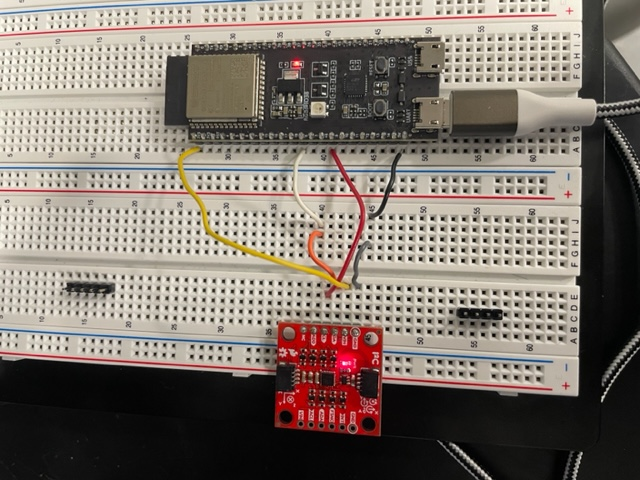
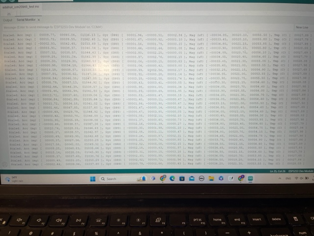
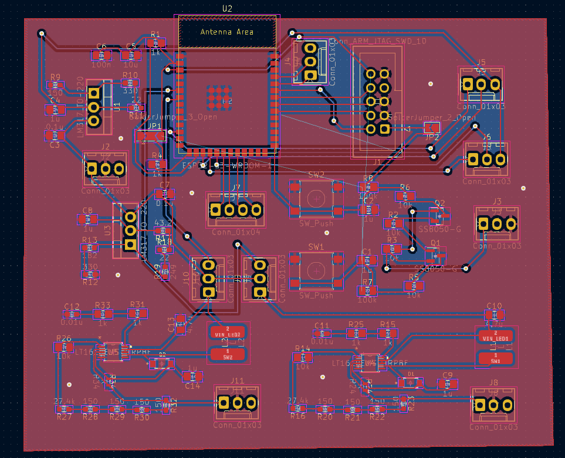

# 02/21/2024
### Pins we will need to use on the ESP32-S3-WROOM-1
* Power -> 3V3
* Ground -> GND
* Enable -> EN
* Strappint Pins -> GPIO0, GPIO3, GPIO45, GPIO 46
* USB -> GPIO 19, 20
* JTAG -> GPIO39, GPIO40, GPRIO41, GPIO42
* UART -> GPIO43, GPIO44
* SPI -> GPIO10, GPIO11, GPIO12, GPIO13
* LEDs -> GPIO1, GPIO2

# 03/19/2024
### Control Unit Schematic and PCB for the first PCB order

# 03/25/2024
### Voltage Regulator Recalculations
Our voltage regulator uses resistor values that we do not have provided, so we used the equation Vout = 1.25*(1+R1/R2) + R2*50e-6 to get new resistor values. The new resistor values to get each voltage are:
* 3.3V -> R1 = 1500Ohms (1.5kOhms), R2 = 2330Oms (1kOhm + 1kOhm + 330Ohms)
* 1.8V -> R1 = 5100Ohms (5.1kOhms), R2 = 1330Ohms (1kOhm + 330Ohms)

# 03/27/2024
### Control Unit Schematic and PCB for the first PCB order

# 04/07/2024
### Data Collection with ESP32 Devboard and IMU Breakoutboard
We have been struggling to use the ESP32 Devboard, but found that the one we were using was broken and were able to use a new one to connect to the IMU breakout board. Below is the setup we used as well as a sample of the data we collected.

 
The data has a substantial amount of noise so it will be important for us to use filtering techniques to clean the data.

# 04/11/2024
### Final Schematic/PCB

### Multiplie Addresses on I2C
We were able to connect two sensors on the I2C bus by changing the address of one and accounting for it in software. We now need to connect the others by figuring out how to add aditional I2C pins on the esp32 through software.

# 04/12/2024
Although we still have not been able to connect another IMU, we were able to use two of them to properly track the hand signals from one hand and print them to the serial monitor using the devboard and breakout boards. We plan on trying to connect the LED's and Power Supply so that it can run as an independent system while we wait for the pcb order to arrive.

# 04/18/2024
We were able to successfully connect the LED's to turn on based on the hand gestures and connect the battery so that we can power everything as an independent system. The hand tracking is a bit finicky so we need to try and imporve it, and we need to connect a 3rd IMU to track the other hand, but other than that we have a functional device. From here our most imporant goal is to get the programming circuit working on the pcb so we can replace the devboard, fine tune the hand tracking, add the 3rd IMU, and encase everything to look professional.
