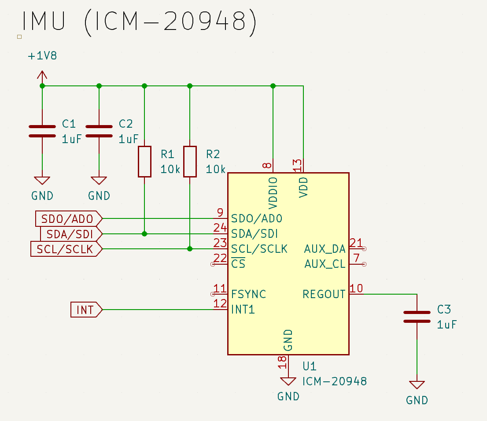

# Kaylan's Lab Notebook

# 2024-02-14 - Discussion with TA Sanjana Pingali

Sanjana gave us the idea to have LEDs on the front of the wearable for visibility for drivers in front of the user. Additionally we were told we might have to design and create our own breakout board for the IMUs so I will be looking into that in the near future.

# 2024-02-19 - Proposal

We are currently working on the proposal rewrite and we decided on removing the back shoulder LEDs and running a longer strip from the wrists up to the shoulder area and then wrapping it above the shoulder to the upper chest. This way we can reduce the load on the battery as well as integrating some front facing lights as discussed with our TA. Visual aid for reference:

I am currently looking into creating a schematic for the IMU breakout board and found that the schematic for the breakout board we were planning on using (Adafruit LSM9DS1 Accelerometer + Gyro + Magnetometer 9-DOF Breakout) has their [schematic](https://learn.adafruit.com/adafruit-lsm9ds1-accelerometer-plus-gyro-plus-magnetometer-9-dof-breakout/downloads) published online. We will likely use this as a reference if we are asked to manufacture the breakout board from scratch. 

# 2024-02-27 - Design Review

I've been thinking about the physical aspect of the project and how we will incorporate the LEDs and electronic components into the wearable. We discussed the idea that the electronics need to be removable so that the user can wash the jacket. Therefore the tentative plan for the physcial design will be the LEDs, IMU will be attached via velcro to the sleeves, PCB and battery in the inner pockets. 

# 2024-03-1 - PCB Review (IMU changes)

I've been working on the IMU schematic and found that the original IMU we wanted to work with (LSM9DS1) is not in stock anymore so we decided to switch to the ICM-20948 IMU. The TA at the PCB review suggested we switch from the SPI protocol to the I2C protocol for the IMU so I have made the necessary changes to the schematic. I'm including the INT and SD0/AD0 signals in the case that we need them. The schematic will be submitted for the first round PCB orders.

# 2024-03-7 - Potential software changes

We were given some feedback from the design review about the complexity of the project, specifically the software and how the gesture recognition algorithm would be implemented. I've been doing some research on how we can use a long short term memory (LSTM) recurrent neural network (RNN) as a decision maker on the ESP-32. An RNN is ideal here because the data we are feeding it will be time series data, meaning the data is recorded over a set interval of time. Going to be cautious about spending too much time on the RNN as the ESP-32 might not even be able to handle the data required to create an accurate model. Additionally we are looking into having 2 IMUs on each arm and mapping out the arms in software. 

# 2024-03-24 - 1st round order

Devkit for the ESP-32 is not working and our PCB from the first order also has issues with the programming circuit. Tried soldering the IMU onto the board but the pads are extrememly small, and without a stencil it seems to be impossible. We are making modifications to see if we can get something ready for the third order. 

# 2024-04-08 - IMU pcb changes

Working on the IMU pcb to get ready for the 5th round orders. Added connectors to make it easier to prototype and work with. Additionally ordering a stencil so we can solder the IMU to the board. Also changing the programming circuit to match the given schematic exactly. 

# 2024-04-10 - 3rd round order

3rd round arrived and the programming circuit still does not work. We are still testing with the devkit and the IMU breakout boards, will likely change the design to only include 2 IMUs, one on the chest and one on the left wrist, take the difference in magnetometer readings to determine which gestures are being used. Fully preparing to do the mock demo with the devkit and breakout boards

# 2024-04-21 - 5th round order

5th round order arrived and we were able to get the main pcb programmed. We didn't include the parts needed to work with more than 2 IMUs (likely a mux to switch between them) and we don't have time to implement them before the final demo on 4-24, so we are rolling with 2 IMUs, one on the chest and one on the wrist. The algorithm for gesture recognition needs quite a bit of calibration but seems to work for now. 

# 2024-04-23 - Physical Design

All the electronics are working, we worked on getting all the components onto the wearable. We 3d printed an enclosure for the PCB to go into the inner jacket pocket while the battery will reside in the opposite side inner jacket pocket. Today we created a waist and wrist strap to hold the IMUs in place while the rider is on a bicycle or similar mode of transport. 

# 2024-04-24 - Final demo day

Before the demo we integrated the LEDs onto the jacket, also using velcro so that the electronics are all removeable for washing the jacket. The LEDs are wired to the PCB on the back of the jacket, routing down to the bottom and up into the inner jacket pocket. The LEDs are visible from all sides as they wrap around the shoulders and arms. We did find that they are less visible during the daytime. 

# 2024-04-25 - Final video

